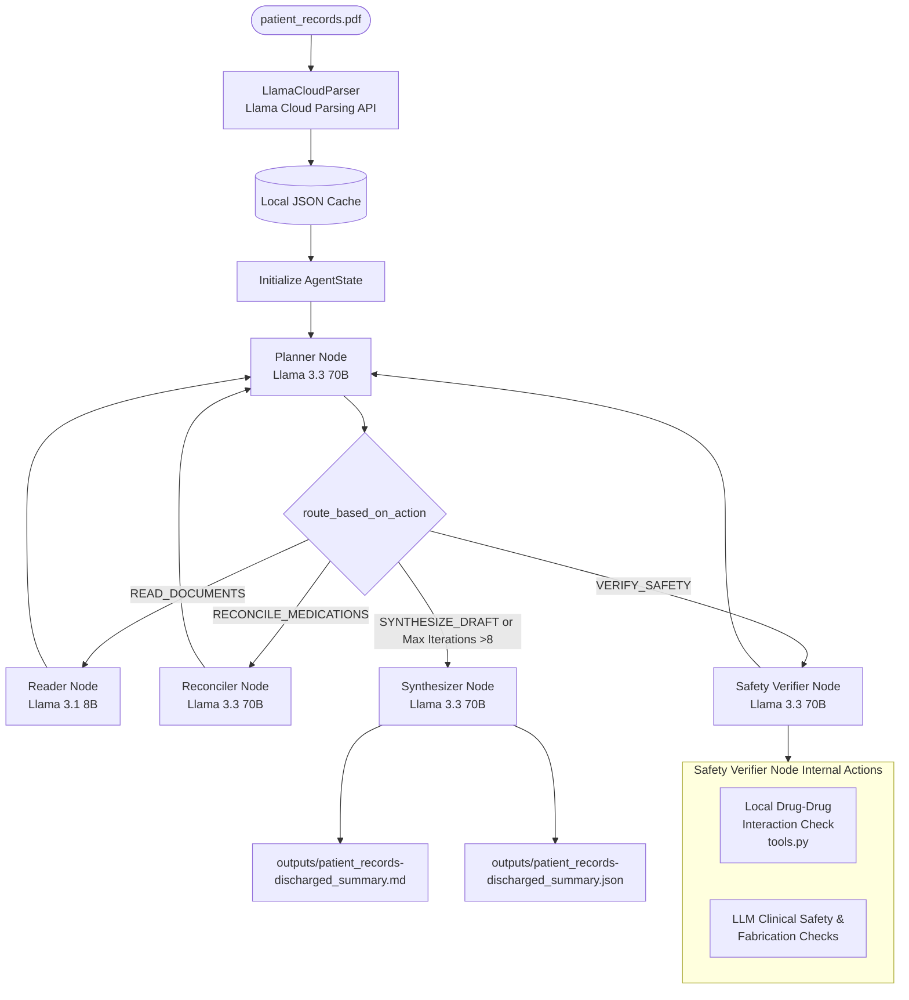

# CliniqBot — Clinical Intelligence Chatbot

> An AI-powered agentic system that ingests raw patient medical records and generates structured, clinically safe discharge summaries using LangChain, Pinecone, Flask, and AWS.

---

## Table of Contents

- [System Architecture](#system-architecture)
- [Workflow Diagram](#workflow-diagram)
- [Key Features](#key-features)
- [Tech Stack](#tech-stack)
- [File Structure](#file-structure)
- [Installation & Setup](#installation--setup)
- [How to Run](#how-to-run)
- [Clinical Safety Guardrails](#clinical-safety-guardrails)
- [Clinician Feedback & Preference Learning](#clinician-feedback--preference-learning)
- [Unit Testing](#unit-testing)
- [AWS CI/CD Deployment](#aws-cicd-deployment-with-github-actions)

---

## System Architecture

The core of CliniqBot is an agentic planning-execution loop. The state machine iterates up to a hard cap of 8 loops, dynamically routing between reading, reconciling, verifying, and synthesizing stages.

**Reasoning model** — GPT / Llama 3.3 70B: Drives orchestration including planning, medication reconciliation, safety verification, and final report synthesis.

**Utility model** — Llama 3.1 8B: Handles high-throughput information extraction inside the Reader Node.

### Main Nodes

| Node | Role |
|---|---|
| 🧠 **Planner** | Central decision-maker. Evaluates accumulated state and chooses the next action. Enforces the 8-iteration cap. |
| 📖 **Reader** | Extracts patient demographics, clinical notes, and lab values using the faster utility model — no hallucination. |
| ⚖️ **Reconciler** | Audits admission vs. discharge medications. Flags unjustified changes with HIGH WARNING. |
| 🛡️ **Safety Verifier** | Checks drug-drug interactions, conflicting statements, missing demographics, and contraindicated medications. |
| ✍️ **Synthesizer** | Compiles all warnings, narratives, and reconciliation data into a Markdown report and structured JSON draft. |

---

## Workflow Diagram



---

## Key Features

- **Intelligent PDF parsing** — Uses LlamaCloudParser for layout-aware markdown extraction with local file caching to avoid redundant API calls.
- **Dynamic planner** — Evaluates `AgentState` at each step and routes to the appropriate worker node.
- **Hybrid model orchestration** — Heavy reasoning on Llama 3.3 70B, fast extraction on Llama 3.1 8B.
- **Line-by-line medication reconciliation** — Cross-references admission and discharge lists. Flags undocumented changes as HIGH WARNING.
- **No-fabrication guarantee** — Missing fields render as `[MISSING - Flagged for Clinician Review]`, never hallucinated.
- **Drug-drug interaction screening** — Code-level DDI matcher for critical pairs (e.g. Aspirin + Warfarin, Sildenafil + Nitroglycerin).
- **Contradiction detection** — Scans and flags conflicting values across clinical progress notes.
- **Observability trace** — Saves reasoning steps and plan checklists to `logs/agent_trace.md`.

---

## Tech Stack

- **Python** — Core language
- **LangChain / LangGraph** — Agentic state machine and LLM orchestration
- **GPT / Groq (Llama 3.3 70B & 3.1 8B)** — Language models
- **Pinecone** — Vector database for medical knowledge embeddings
- **LlamaCloud** — Visual PDF layout parsing
- **Flask / Streamlit** — Web and CLI interfaces
- **Docker + AWS ECR + EC2** — Containerised cloud deployment
- **GitHub Actions** — CI/CD pipeline

---

## File Structure

```
cliniqbot/
├── app.py                        # Streamlit web interface
├── main.py                       # CLI entrypoint
├── pyproject.toml                # Project metadata and dependencies
├── .env                          # API keys (not committed to Git)
├── Dockerfile                    # Container definition
│
├── clinical_agent/
│   ├── config.py                 # API key validation and model assignments
│   ├── graph.py                  # StateGraph and conditional routing
│   ├── nodes.py                  # Core node functions
│   ├── state.py                  # AgentState type dictionary
│   ├── tools.py                  # DDI matcher and interaction reference DB
│   ├── prompts.py                # System prompts for all nodes
│   ├── parser.py                 # LlamaCloud integration with local caching
│   └── learning.py               # Clinician preference learning module
│
├── outputs/
│   └── example-discharged_summary.md   # Reference output example
│
├── scripts/
│   └── run_learning_eval.py      # Feedback loop simulation and eval
│
├── tests/
│   └── test_clinical_agent.py    # Unit tests
│
└── .github/
    └── workflows/                # GitHub Actions CI/CD pipeline
```

---

## Installation & Setup

### STEP 0 — Clone the repository

```bash
git clone https://github.com/AnjaliYadav-04/CliniqBot-Clinical-Intelligence-Chatbot
cd cliniqbot
```

### STEP 1 — Create and activate a virtual environment

```bash
python3 -m venv .venv
source .venv/bin/activate
```

Or use the `uv` package manager (auto-handles the environment):

```bash
uv sync
```

### STEP 2 — Install dependencies

```bash
pip install -r requirements.txt
```

### STEP 3 — Configure environment variables

Create a `.env` file in the root directory:

```ini
PINECONE_API_KEY      = "xxxxxxxxxxxxxxxxxxxxxxxxxxxxx"
OPENAI_API_KEY        = "xxxxxxxxxxxxxxxxxxxxxxxxxxxxx"
GROQ_API_KEY          = "xxxxxxxxxxxxxxxxxxxxxxxxxxxxx"
LLAMA_CLOUD_API_KEY   = "xxxxxxxxxxxxxxxxxxxxxxxxxxxxx"
```

### STEP 4 — Store embeddings to Pinecone

```bash
python store_index.py
```

---

## How to Run

### Option 1 — Streamlit graphical interface (recommended)

```bash
uv run streamlit run app.py
```

Launches an interactive, medical-themed UI with file upload, real-time agent trace logs, and draft downloads.

### Option 2 — Command line

```bash
uv run python main.py
```

Runs the agent synchronously on `data/patient_records.pdf` and saves outputs to `outputs/`.

### Option 3 — Flask server

```bash
python app.py
```

Then open `http://localhost:5000`

---

## Clinical Safety Guardrails

| Check | Mechanism | Safeguard |
|---|---|---|
| Drug-Drug Interactions | Code-level DDI matcher in `tools.py` | Warns on critical pairs: Aspirin + Warfarin, Lisinopril + Potassium, Sildenafil + Nitroglycerin |
| Fabrication Prevention | Strict prompt engineering + state constraints | Renders `[MISSING - Flagged for Clinician Review]` instead of hallucinating data |
| Document Conflicts | Cross-referencing page logs | Flags contradictory lab values across source notes |
| Clinical Contraindications | Verifier system prompt | Prevents inappropriate additions (e.g. Loperamide during active bacterial gastroenteritis) |

---

## Clinician Feedback & Preference Learning

CliniqBot implements an in-context preference learning loop to capture style corrections from clinician edits — without expensive model fine-tuning.

**How it works:**

1. A simulated senior clinician editor applies a strict hidden editing policy: generic drug substitutions (e.g. "Lasix" → "furosemide"), lab qualifier annotations (e.g. "Sodium: 131 mEq/L (Low)"), and structured follow-up formatting.
2. The preference learner compares the original and corrected drafts and saves learned rules to `cache/correction_memory.json`.
3. On subsequent runs, those rules are injected as `CRITICAL ADAPTATION DIRECTIVES` into the Synthesizer's system prompt.

**Safety constraint:** Style optimization never overrides clinical detail — the Verifier node's safety constraints strictly take precedence.

**Run the learning simulation:**

```bash
uv run python scripts/run_learning_eval.py
```

Results are saved to `logs/evaluation_results.json`.

---

## Unit Testing

```bash
uv run python -m unittest tests/test_clinical_agent.py
```

Covers DDI lookups, JSON parsing, router endpoints, and parser caching.

---

## AWS CI/CD Deployment with GitHub Actions

### 1. Login to AWS console

### 2. Create an IAM user for deployment

Grant the following policies:

- `AmazonEC2ContainerRegistryFullAccess`
- `AmazonEC2FullAccess`

**Deployment flow:**

1. Build a Docker image of the source code
2. Push the image to ECR (Elastic Container Registry)
3. Launch an EC2 instance (Ubuntu)
4. Pull the image from ECR on EC2
5. Run the Docker container on EC2

### 3. Create an ECR repository

Save the URI after creation, e.g.:

```
315865595366.dkr.ecr.us-east-1.amazonaws.com/CliniqBot-Clinical-Intelligence-Chatbot
```

### 4. Launch an EC2 instance (Ubuntu)

### 5. Install Docker on EC2

```bash
# Update packages
sudo apt-get update -y
sudo apt-get upgrade -y

# Install Docker
curl -fsSL https://get.docker.com -o get-docker.sh
sudo sh get-docker.sh
sudo usermod -aG docker ubuntu
newgrp docker
```

### 6. Configure EC2 as a self-hosted GitHub Actions runner

Go to your GitHub repo → **Settings → Actions → Runners → New self-hosted runner**, choose your OS, and follow the commands provided.

### 7. Add GitHub secrets

Go to **Settings → Secrets and Variables → Actions** and add:

| Secret | Description |
|---|---|
| `AWS_ACCESS_KEY_ID` | IAM user access key |
| `AWS_SECRET_ACCESS_KEY` | IAM user secret key |
| `AWS_DEFAULT_REGION` | e.g. `us-east-1` |
| `ECR_REPO` | Your ECR URI |
| `PINECONE_API_KEY` | Pinecone API key |
| `OPENAI_API_KEY` | OpenAI API key |
| `GROQ_API_KEY` | Groq API key |
| `LLAMA_CLOUD_API_KEY` | LlamaCloud API key |

---

> Built by [Anjali Yadav](https://github.com/AnjaliYadav-04) · AI / ML Engineer · University of Mumbai
>
> **CliniqBot** — Bringing clinical intelligence to conversational AI.
